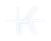
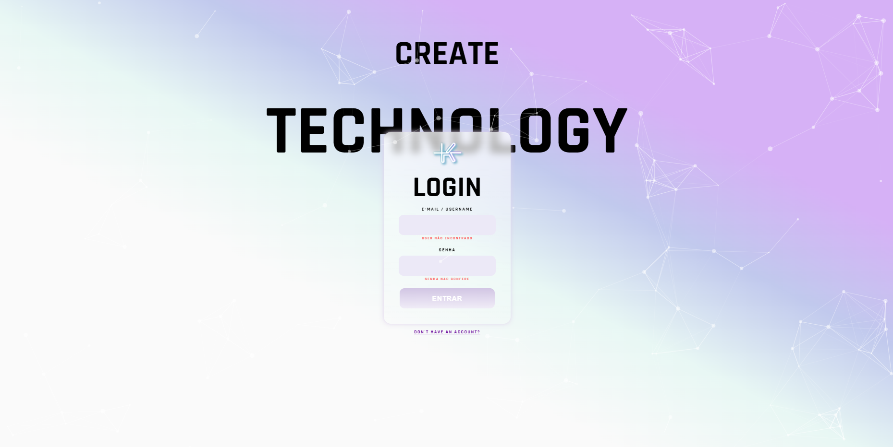
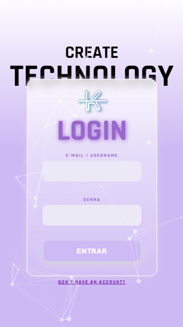

<div align="center">
  
</div>

## Desafio Kolabs


<h4 align="center">
  Repositório destinado a página criada para o desafio da Kolabs.
</h4>

<div align="center">
    
    
</div>

## Tecnologias

No desenvolvimento do projeto, foram utilizadas tecnologias front-end de ponta.


- [ReactJS](https://reactjs.org/)
- [Javascript](https://www.javascript.com/)

## Rodando a aplicação

### Requisitos

- Para rodar o projeto, você precisa ter o [NPM](https://docs.npmjs.com/downloading-and-installing-node-js-and-npm) instalado.

**Clone o repositório e acesse a pasta clonada**

$ git clone https://github.com/enzoggqs/desafio-kolabs && cd desafio-kolabs

**Siga os passos abaixo**

```
# Instale as dependências
$ npm install

# Run the web server
$ npm start
```

A aplicação estará disponível para ser acessada em seu navegador em `http://localhost:3000`

Made with 💜 by Enzo Gabriel [Check out my LinkedIn](https://www.linkedin.com/in/enzoggqs)
